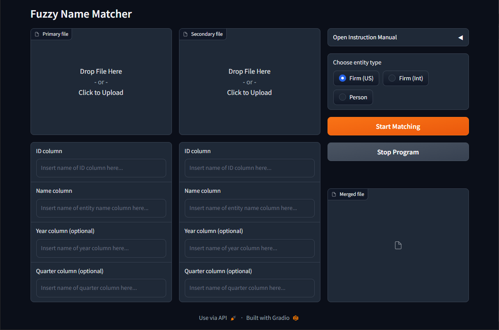

# Fuzzy Name Matcher



## Overview

`Fuzzy Name Matcher` promotes the merging of two datasets in the absence of unique keys using entity names. Under the hood, it leverages the [thefuzz](https://github.com/seatgeek/thefuzz) Python package for fuzzy string matching.


## Usage

1. Upload the two datasets that are supposed to be merged (in `.csv` or `.dta` format). *primary file* and *secondary file* denote the left- and right-hand-side dataset of the merge. A left-join is performed, i.e., values in the *secondary file* are attached to rows in the *primary file*. In case you `.csv` format, please ensure that the files are encoded in `utf-8`.
2. Specify the relevant merge columns:
  - *ID column*: Name of the column that contains the unique entity ID.
  - *Name column*: Name of the column that contains the entity name (e.g., firm or person name).
  - *Year column* (optional): Name of the column that contains year information.
  - *Quarter column* (optional): Name of the column that contains quarter information.<br><br>The *Year column* and *Quarter column* fields might be relevant for panel datasets where entity names can change over time or different entities can exhibit identical names at different points in time.
3. Choose entity type (either firm names or person names). Based on the entity type different string normalization operations are performed to preprocess the names prior to matching. Select `Firm (US)` or `Firm (Int)` if the sample is U.S.-based only or international to accomodate different sets of legal forms.
4. Start merge by clicking on "Start Matching" and download the results. *Note: Klick on "Stop Program" to interrupt matching, e.g., if the runtime exceeds budget.*

## Docker Deployment

1. Uncomment corresponding `app.launch()` command at the end of `main.py`

2. Build docker image called `fnm` from working repository
```bash
docker build --tag fnm .
docker images
```

3. Run docker container `fnm` in detached mode from latest image (`fnm:latest`) and expose container port (`7878`) to host post (`7000`)
```bash
docker run -d -it --name fnm -p 7000:7878 fnm:latest
docker ps -a
```

4. Check for successful start-up. The app should be available via http://localhost:7000/. Optionally, check container contents.
```bash
docker logs -f fnm
docker exec fnm ls /app/
```

5. Stop and remove container
```bash
docker stop fnm && docker rm fnm
```


## Output

The resulting merge file has the following structure:

| ID column<br>(pf) | Name column<br>(pf) | Name normalized<br>(pf) | Name normalized of match<br>(sf) | Match score<br>(1-100) | ID column<br>(sf) | Name column<br>(sf) |
|-----------------------------|-------------------------------|-----------------------------------|----------------------------------------------|------------------------|-------------------------------|---------------------------------|
| 6094                        | MEDICIS PHARMACEUTICAL CORP   | medicispharmaceutical             | medicispharmaceutcp                          | 90                     | 21186                         | MEDICIS   PHARMACEUT CP  -CL A  |

Matching scores indicate string similarity with higher scores reflecting more similar strings. Values above 90-95 commonly denote reasonably accurate matches.
